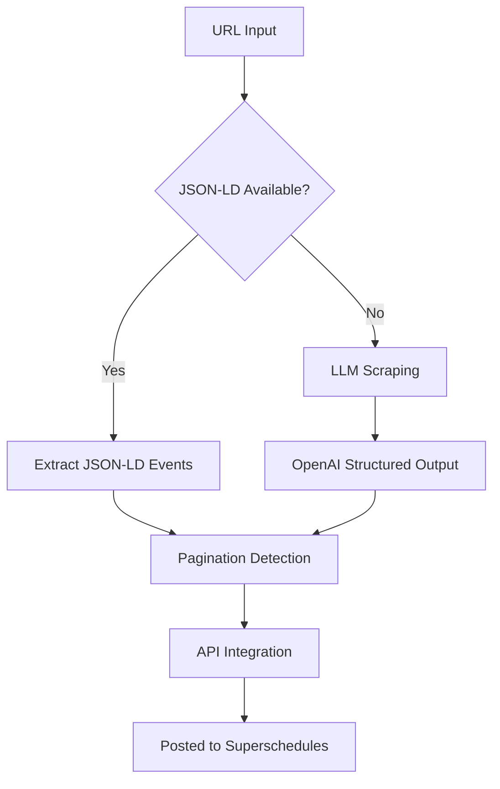

# Superschedules Collector

> Intelligent event data collection from websites using hierarchical scraping strategies

A standalone Python tool for collecting event information from multiple sources and posting it to the Superschedules API.

## Quick Start

### Installation

```bash
pip install -r requirements.txt
```

### Basic Usage

```bash
# Process a single URL
python -m jobs.process_url https://needhamlibrary.org/events/

# Run all collection jobs
python -m jobs.run_everything
```

## Running the Collector

### Command Line Interface

| Command | Description |
|---------|-------------|
| `python -m jobs.run_everything` | Run all scrapers and LLM agent |
| `python -m jobs.process_url <URL>` | Process a single URL |

### FastAPI Server

Start the API server for programmatic access:

```bash
# Development mode (auto-reload, debug logging)
python start_api.py

# Production mode 
python start_api.py --prod

# Custom port (default: 8001)
python start_api.py --port 8080
```

#### API Access Points

| Endpoint | URL |
|----------|-----|
| **Base URL** | http://localhost:8001 |
| **Interactive Docs** | http://localhost:8001/docs |
| **Health Check** | http://localhost:8001/health |

> **Note:** Port 8001 is used by default to avoid conflicts with the main backend on port 8000

#### API Endpoints

| Method | Endpoint | Description |
|--------|----------|-------------|
| `GET` | `/health` | Health check |
| `GET` | `/live` | Liveness probe for containers |
| `GET` | `/ready` | Readiness probe for orchestration |
| `POST` | `/scrape` | **Main endpoint for event scraping** |

#### Example API Usage

```bash
curl -X POST "http://localhost:8001/scrape" \
  -H "Content-Type: application/json" \
  -d '{
    "url": "https://needhamlibrary.org/events/",
    "search_methods": ["jsonld", "llm"],
    "event_tags": ["workshop", "lecture"],
    "additional_info": {}
  }'
```

## Configuration

Environment variables are loaded from `.env` (see `.env.example`).

| Variable | Description |
|----------|-------------|
| `OPENAI_API_KEY` | Your OpenAI API key |
| `SCRAPER_DEBUG=1` | Enable debug logging |

## How It Works

The collector uses a **hierarchical fallback strategy** for maximum reliability:



### Extraction Methods

1. **JSON-LD Extraction**
   - Looks for structured Schema.org JSON-LD metadata
   - Fast and reliable when available

2. **LLM Scraping** 
   - Falls back to OpenAI's structured-output API
   - Parses raw HTML intelligently

3. **Pagination Detection**
   - Automatically detects and handles paginated event listings
   - Multi-strategy approach (CSS, JavaScript, LLM)

## Development

### Testing

```bash
# Test pagination detection with local snapshots
python test_pagination.py

# Refresh snapshots from live sites
python test_pagination.py --refresh-snapshots

# Test against live sites (not recommended for CI)
python test_pagination.py --live
```

### LLM Testing

The `llm_testing/` directory contains tools for comparing different LLM models:

```bash
cd llm_testing
python test_runner.py  # Test Gemma2:7b vs OpenAI
```

## Project Structure

```
superschedules_collector/
├── api/                    # FastAPI server
├── ingest/                 # API client & data processing
├── jobs/                   # Main execution scripts
├── llm_testing/            # LLM comparison tools
├── scrapers/               # Event extraction modules
├── tests/                  # Unit tests
└── test_data/              # Test HTML snapshots
```

---

**Built for efficient event data collection**
